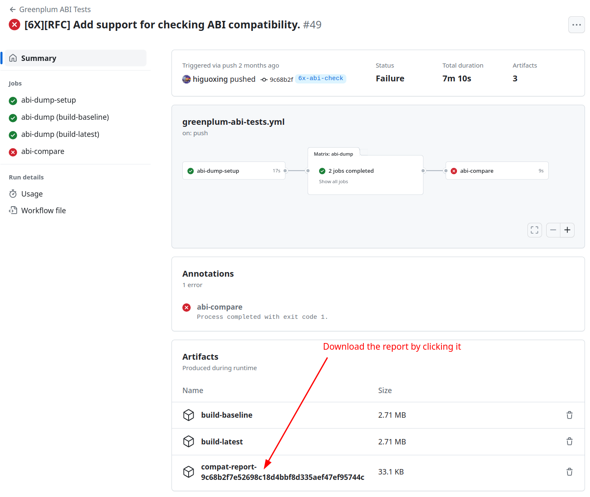

# Check the compatibility of Greenplum ABI.

## Introduction

We use the [`abi-dumper`](https://github.com/lvc/abi-dumper) and [`abi-compliance-checker`](https://github.com/lvc/abi-compliance-checker/) to check the Greenplum's ABI. We also use the [GitHub action](../.github/workflows/greenplum-abi-tests.yml) to automate this job.

## Requirements

`abi-dumper` requires the binary being compiled with `-Og -g3`, hence the `CFLAGS` for configuration looks like:

```bash
## GCC's maybe-uninitialized checker may produce false positives with different
## levels of optimizations. To prevent building failures, we append the '-Wno-maybe-uninitialized'
## to the $CFLAGS as well.
CFLAGS='-Og -g3 -Wno-maybe-uninitialized' ./configure --with-xxx --with-yyy --with-zzz
```

## Check the ABI's compatibility

Several binaries are shipped in Greenplum, e.g., `$GPHOME/bin/postgres`, `$GPHOME/lib/libpq.so`, etc. Since the `postgres` binary are referenced by many extensions, the ABI compatibility of it is the most important. The following steps illustrate how to check the ABI compatibility of the `postgres` binary.

1. Dump the ABI information of one `postgres` binary.
   ```
   abi-dumper $GPHOME/bin/postgres -lver <version of the binary> -o <output file>
   ```
   - `<version of the binary>`: The version of the binary. You can give it some reasonable name, e.g., `7.0.0` to indicate the binary is built from '7.0.0' tag.
   - `<output file>`: The file path for dumping the ABI information, e.g., `greenplum-7.0.0.dump`
   
2. Dump the ABI information of another `postgres` binary (same as the step 1).

3. Compare the ABI between these two binaries with `abi-compliance-checker`.
   ```
   abi-compliance-checker \
         -lib <library name> \
         -old <output file from step1> \
         -new <output file from step2>
   ```
   - `<library name>`: The name of the library, e.g., `postgres`.

4. By default, the `abi-compliance-checker` will produce an HTML web page and there will be detailed information about ABI changes.

## Ignore the "Safe ABI breaking change"

There might be "safe ABI breaking changes", e.g., some symbol being removed and not referenced by any extensions or programs. Here are steps on how to suppress such errors.

1. Add ignored symbols to `gpdb_src/.abi-check/<base version>/postgres.symbols.ignore` (one symbol per line).
   - `<base version>`: The baseline version of Greenplum. If we want to ensure the ABI isn't broken between the `7.0.0` release and the latest `main`. The baseline version of Greenplum is `7.0.0`. See: [./7.0.0/postgres.symbols.ignore](./7.0.0/postgres.symbols.ignore)

2. Add ignored types to `gpdb_src/.abi-check/<base version>/postgres.types.ignore` (one type per line).
   - `<base version>`: The baseline version of Greenplum. If we want to ensure the ABI isn't broken between the `7.0.0` release and the latest `6X_STABLE`. The baseline version of Greenplum is `7.0.0`. See: [./7.0.0/postgres.types.ignore](./7.0.0/postgres.types.ignore). Add the `struct` keyword in front of the struct name if we need to ignore a struct type.

3. Pass these two files to `abi-compliance-checker` and it will produce a report in HTML format.
   ```
   abi-compliance-checker -skip-symbols gpdb_src/.abi-check/<base version>/postgres.symbols.ignore \
                          -skip-types   gpdb_src/.abi-check/<base version>/postgres.types.ignore \
                          -lib postgres \
                          -old greenplum-<base version>.dump
                          -new greenplum-new.dump
   ```
   It will produce a ABI report in `./compat_reports/postgres/X_to_Y/compat_report.html`.

## View the ABI compatibility report

### View the report locally

You can either open the HTML report in your browser or dump it to stdout using `lynx -dump compat_reports/postgres/X_to_Y/compat_report.html`.

## View the report from GitHub Action

1. Navigate to the "Summary" page of the test.
2. Click the report and download it.
3. View the report as above.


